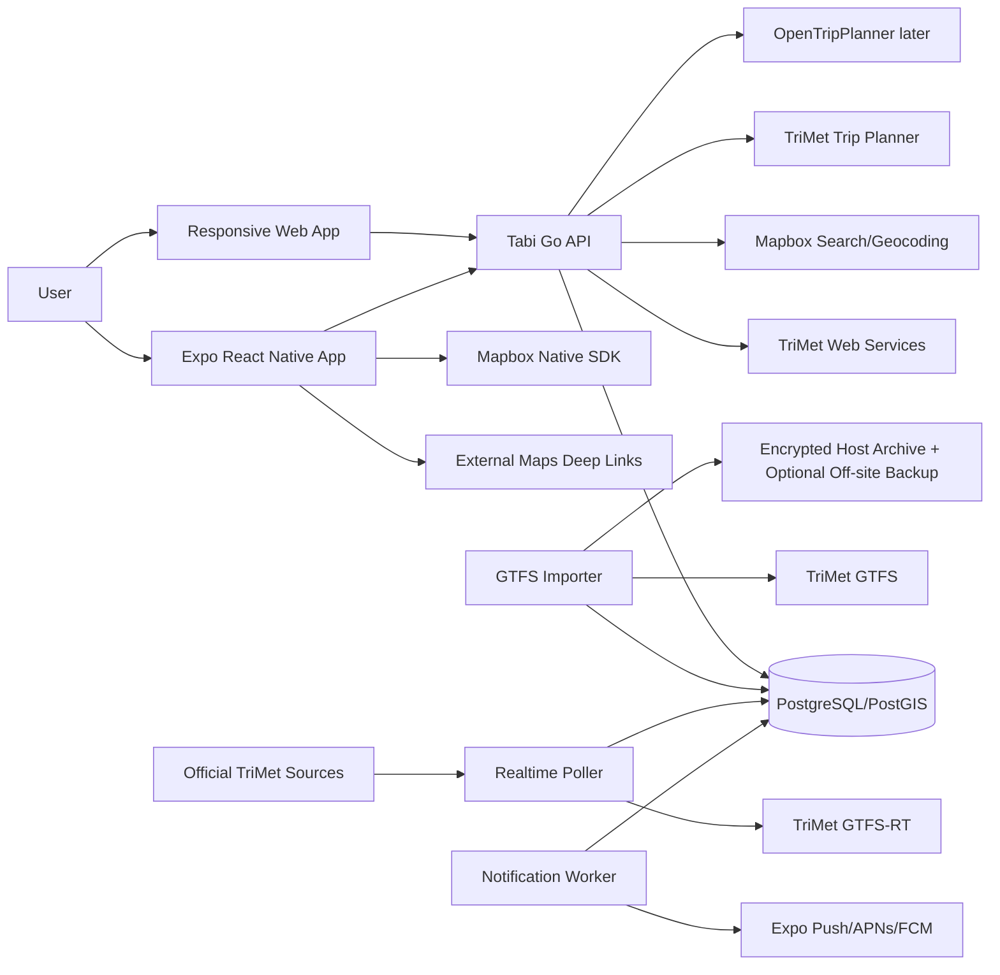

# System Architecture

## Principles

1. Contract first.
2. Official sources first.
3. Normalize provider data at the backend.
4. Local-first static/favorites/recent reads.
5. Map is a view, not the data model.
6. Modular monolith and separate binaries before microservices.
7. Freshness is part of every realtime contract.
8. Fail soft by source.
9. Minimal, visible location/telemetry behavior.
10. Automated release/operations from the start.

## Runtime context



## Deployables

### `transit-api`

Go HTTP service exposing `/v1`, reading normalized data, applying validation/rate limits/cache, calling selected upstream services, and exposing health/readiness/metrics. Long imports never execute in requests.

### `gtfs-importer`

Fetch/archive/validate/load/activate GTFS. Uses staging/versioned data and atomic activation; preserves prior version.

### `realtime-poller`

Independent feed loops for vehicle positions, trip updates, and alerts. Writes valid current snapshots and source health. A bad fetch never deletes the last good snapshot.

### Deployment topology

The canonical runtime is one Linux server running Docker Compose. Caddy is the only public container; PostgreSQL, poller, workers, jobs, and metrics remain on private Compose networks. The database and archives use named or bind-mounted persistent volumes. Host systemd timers invoke one-shot Compose jobs for imports, backups, verification, and retention.

### `notification-worker`

Evaluates subscriptions, deduplicates, honors quiet hours/expiry, sends push, processes receipts, disables invalid tokens.

### OpenTripPlanner

Separate Java container and Compose profile only after an ADR demonstrates a TriMet planner gap worth OSM/GTFS graph operations and the host has measured capacity.

## Client boundaries

```text
packages/     Pure TypeScript domain, API client, schemas, query keys, tokens
apps/mobile/  Expo Router, native UI, SQLite, Expo/native wrappers, RNMapbox
apps/web/     Web router, semantic HTML UI, IndexedDB, browser wrappers, web map adapter
```

TanStack Query owns server state; client-local UI stores own ephemeral state;
SQLite (native) and IndexedDB (web) own device-local/static persistence.

## Data authority

| Data | Authority | Storage |
|---|---|---|
| stops/routes/trips/schedules/shapes | TriMet GTFS | PostgreSQL; selected SQLite cache |
| vehicles/trip updates/alerts | GTFS-RT/approved adapters | current normalized snapshots |
| detailed arrivals/vehicle/trip/block | TriMet Web Services | short-lived cache/current enrichment |
| itineraries | TriMet planner initially | ephemeral cache; selected local item |
| places/geocoding | Mapbox APIs | terms-aware temporary cache |
| favorites/recents | device action | SQLite |
| subscriptions | user action | PostgreSQL |
| Streetcar/other | approved canonical source | adapter then normalized model |

## Key flows

### Live map

Poll source → validate/normalize → store snapshot and freshness → API serves compact JSON/GeoJSON with ETag → mobile foreground polling → update one `ShapeSource` → native filters/layers → selected detail enrichment.

### Nearby

Location/map/search point → validated `radius/modes/limitPerMode` → PostGIS `ST_DWithin` and nearest ordering → grouped results → stable stop cache in SQLite.

### GTFS release

Download/digest → archive → validate → staging load → comparison → atomic active version switch → cache/version invalidation → mobile static manifest update. Failure leaves the current version active.

### A-to-B

Resolve endpoints → backend planner adapter → normalize itinerary → deterministic filter/rank unsupported constraints → attach alert/freshness → mobile text timeline and map → optional external walking deep link.

## Resilience

- Provider-specific timeouts, retry budgets, circuit breakers, health.
- Retries only for eligible idempotent operations with jitter.
- Bounded caches and conditional HTTP.
- Source-configurable stale thresholds.
- Static fallback during realtime failure.
- Readiness reflects ability to serve core data, not every optional source.
- Graceful cancellation and shutdown.

## Scaling order

Tune queries/payloads → ETag/CDN where terms allow → Redis only when distributed cache/dedupe is required → scale poller/worker independently → read replicas/history partitioning → regional tenancy → service splits only with evidence.

## Constraints

- No privileged TriMet calls from mobile.
- No undocumented direct-source dependency.
- No all-fleet `MarkerView` rendering.
- No terms-violating geocoder storage.
- No assumption that upstream timestamps are current.
- No required account.
- No Tabi GraphQL in MVP.
- No OTP before its decision gate.
